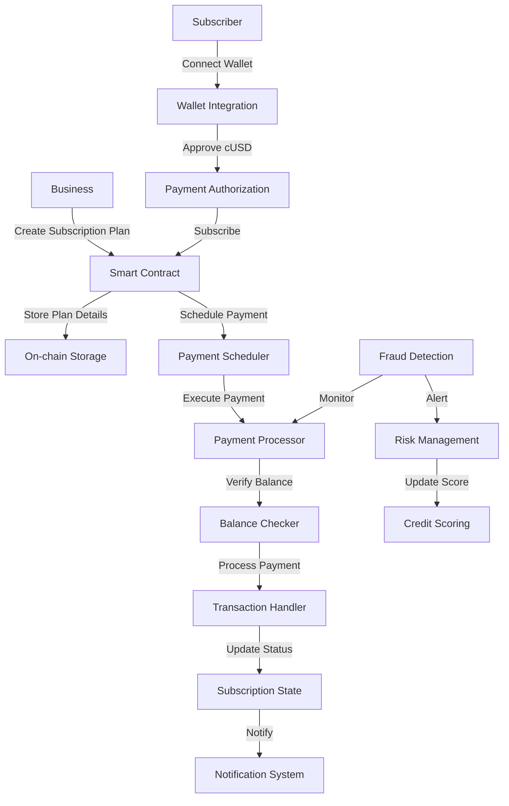

### SubPay: A DeFi-Based Subscription Payment Protocol

## 📑 Project Description

SubPay is a decentralized finance (DeFi) protocol that enables automated, recurring subscription payments using stablecoins on the Celo blockchain. It bridges the gap between traditional subscription models and blockchain technology, offering businesses an efficient way to manage subscriptions while giving users full control over their payments.

### Recent Updates
- **Proof of Ship Season 4 Update**: Successfully deployed on Celo Mainnet! 🎉
- Watch our latest update video for Proof of Ship Season 3: [SubPay Update Video](https://youtu.be/GxkoArHgBBI)
- Watch our Proof of Ship Season 2 update: [SubPay Season 2 Update](https://www.youtube.com/watch?v=xqlpGN4L31o)

### Key Features (Implemented)

- **Smart Contract-Based Subscriptions** – Automates recurring payments with user-defined parameters.
- **Stablecoin Integration** – Uses cUSD for stable payments.
- **Fraud Detection System** – Real-time monitoring of suspicious activities and payment patterns.
- **Business Management Dashboard** – Tools for creating, monitoring, and managing subscriptions.
- **User Sovereignty** – Transparent billing, easy modifications, and full user control over payments.
- **Low Transaction Costs** – Reduces fees compared to traditional payment processors.
- **Progressive Web App** – Access features across desktop and mobile with offline support.

## 🔍 Problem Statement

The current Web3 ecosystem lacks efficient subscription payment solutions due to:

- **No Native Recurring Payment Mechanisms** – Blockchain transactions are typically one-time payments.
- **High Transaction Costs** – Traditional processors charge excessive fees.
- **Payment Reliability Issues** – No automated verification of wallet balances or user creditworthiness.
- **Limited Credit Assessment** – No traditional credit scoring in blockchain transactions.
- **Complex User Experience** – Many existing crypto subscription models require manual renewals.
- **Cross-Border Limitations** – High fees and regulatory barriers for global transactions.

## 💡 Solution Overview

### Core Components

1. **Smart Contract Subscription Framework**
   - Handles subscription creation, execution, and termination.
   - Manages recurring payments and billing cycles.
   - Provides dispute resolution mechanisms.

2. **Stablecoin-Powered Payments**
   - Uses cUSD for price stability.
   - Enables global payments without volatility.
   - Reduces transaction costs.

3. **Fraud Detection & Risk Management**
   - Real-time monitoring of payment patterns.
   - Credit score assessment.
   - Suspicious activity detection.
   - Automated risk scoring.

4. **Automated Billing & Notifications**
   - Smart contracts handle scheduled payments.
   - Automated alerts for upcoming transactions.
   - Payment success/failure notifications.

5. **User & Business Dashboards**
   - **Subscribers:** Manage subscriptions, cancel, or modify anytime.
   - **Businesses:** Set up pricing models, track revenue, and manage subscribers.

6. **On-Chain Dispute Resolution**
   - Transparent mechanism for handling disputes.
   - Evidence submission and verification.
   - Automated refund processing.

## 🔄 Application Flow

### 1. Subscription Creation
- Business creates subscription plan with parameters (price, duration, etc.)
- Smart contract validates and stores plan details
- Plan becomes available for subscribers

### 2. Subscription Management
- Subscribers browse available plans
- Connect wallet and approve cUSD spending
- Subscribe to chosen plan
- Smart contract handles recurring payments automatically

### 3. Payment Processing
- Automated payment execution at scheduled intervals
- Real-time balance checking
- Payment success/failure notifications
- Transaction history tracking

### 4. Fraud Detection & Risk Management
- Real-time monitoring of payment patterns
- Credit score assessment
- Suspicious activity detection
- Risk score calculation
- Automated alerts for potential fraud

### 5. Dispute Resolution
- On-chain dispute creation
- Evidence submission
- Resolution process
- Refund handling

## 📊 Contract Flow

The diagram above illustrates the flow of interactions between different components of the SubPay protocol:

1. **Business Layer**
   - Businesses create subscription plans
   - Plans are stored on-chain
   - Parameters are immutable once set

2. **Subscriber Layer**
   - Wallet connection and authorization
   - cUSD approval for recurring payments
   - Subscription management

3. **Payment Layer**
   - Automated payment scheduling
   - Balance verification
   - Transaction processing
   - State management

4. **Security Layer**
   - Real-time fraud monitoring
   - Risk assessment
   - Credit scoring
   - Automated alerts

## 🎯 Use Cases

### 1. Content Platforms
- News websites
- Streaming services
- Educational platforms

### 2. SaaS Businesses
- Software subscriptions
- Cloud services
- API access

### 3. Membership Services
- DAO memberships
- Community access
- Premium features

### 4. Utility Services
- Internet providers
- Cloud storage
- API services

## 🏆 Competitive Advantages

- **Cost Efficiency:** Lower fees compared to traditional processors.
- **Advanced Risk Management:** Real-time fraud detection and credit scoring.
- **Mobile-First Design:** Built for Celo's mobile-friendly blockchain.
- **Global Accessibility:** Borderless payments with stablecoin support.
- **Security & Transparency:** Immutable smart contract-based billing.

- **Programmable Subscriptions:** Dynamic pricing and usage-based billing.

## 🚀 Project Milestones

### ✅ Completed
- Smart contract development and deployment
- Basic subscription functionality
- Wallet integration
- Payment processing
- Basic fraud detection system
- Business dashboard
- Subscriber interface
- PWA implementation

### 🚧 In Progress
- Enhanced fraud detection algorithms
- Advanced analytics dashboard
- Multi-currency support
- Automated dispute resolution
- Integration with more wallets

### 📅 Upcoming
- AI-powered risk assessment
- Cross-chain compatibility
- Advanced subscription models
- Developer API
- Mobile app development
- Integration with traditional payment systems

## 🛠️ Technical Implementation

### Smart Contracts
- Subscription management
- Payment processing
- Dispute resolution
- Fee collection

### Contract Addresses
- **Subpay Mainnet Contract:** [0xEe4A24B5138D2C09e160EBe60E579a48DAff0BE1](https://celoscan.io/address/0xEe4A24B5138D2C09e160EBe60E579a48DAff0BE1)
<!-- - **Subpay Alfajores Contract:** [0x089D37C1Ca872221E37487c1F2D006907561B1fd](https://celo-alfajores.blockscout.com/address/0x089D37C1Ca872221E37487c1F2D006907561B1fd) -->

### Frontend
- Next.js 15
- Tailwind CSS
- RainbowKit for wallet integration
- Real-time updates

### Backend Services
- Payment processing
- Fraud detection
- Analytics
- Notification system

## 📱 SubPay PWA Features

- **Wallet Integration**: Connect your crypto wallet using RainbowKit
- **Role-based Access**: Support for both Subscribers and Business users
- **Subscription Management**: Create, manage, and cancel subscription plans
- **Real-time Analytics**: Track revenue, active users, and churn rate
- **Offline Support**: Access basic features without internet connection
- **Push Notifications**: Receive updates about payments and subscription status
- **Responsive Design**: Seamless experience across desktop and mobile devices

## 📊 Current Status

The project has successfully implemented:
- Core subscription functionality
- Basic fraud detection
- Business and subscriber dashboards
- Payment processing with cUSD
- Dispute resolution system
- **Mainnet Deployment** on Celo Network
- Enhanced security features based on Season 3 feedback
- Improved gas optimization for mainnet deployment

## 🔮 Future Development

### Short-term Goals
- Implement Superfluid subscription widget for enhanced payment streaming capabilities
- Enhance fraud detection accuracy
- Add more subscription models
- Improve user experience
- Expand analytics capabilities
- **Post-Mainnet Launch**:
  - Monitor and optimize gas usage
  - Gather user feedback from mainnet deployment
  - Implement additional security measures
  - Scale infrastructure for increased usage

### Long-term Vision
- Advanced AI integration
- Global payment network
- Enterprise solutions

## 🌎 Connect with Us

- **Documentation:** [Docs](https://subpay.hashnode.space/default-guide/celosubpay-a-defi-based-subscription-payment-protocol)
- **Email:** [nasihudeen04@gmail.com](mailto:nasihudeen04@gmail.com)

## 🛡️ License

This project is licensed under the **MIT License** – see the [LICENSE](LICENSE) file for details.

## 📊 Project Status

SubPay is currently in active development. We're working on:

- Implementing AI risk management features
- Building integration tools for developers

